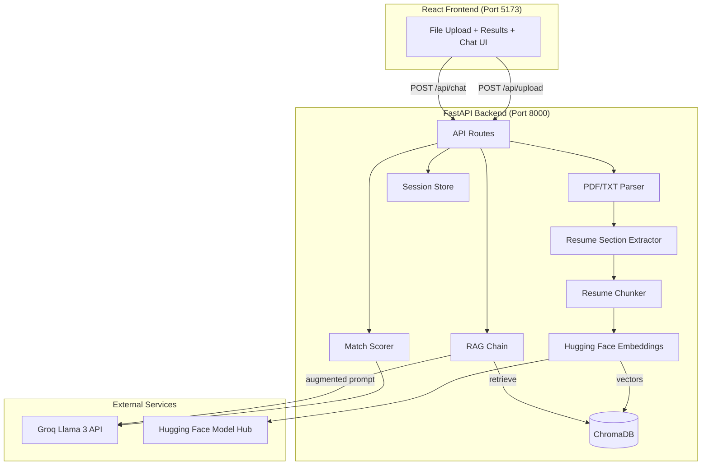
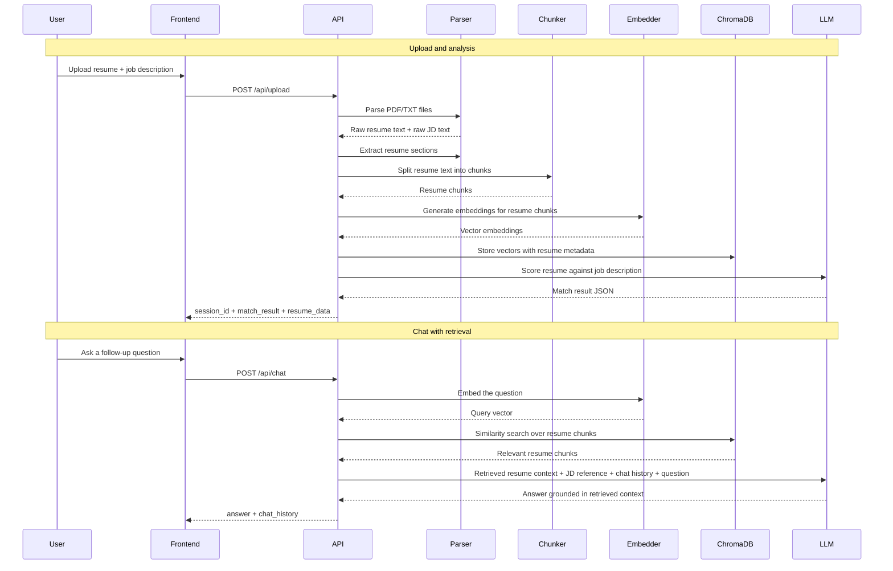

# Resume Screening Tool

This submission implements the Python + React + RAG/LLM version of the assessment in `Assessment_1.pdf`. Recruiters can upload one resume and one job description, receive an instant match analysis, review extracted resume highlights, and ask follow-up questions through a context-aware RAG chat.

Built with FastAPI, React 18, TypeScript, Groq-hosted Llama 3, Hugging Face embeddings, and ChromaDB.

## Objective

The goal of this project is to satisfy the assessment requirements for a Resume Screening Tool that can:

- accept one resume and one job description in PDF or TXT format
- calculate a match score with strengths, gaps, insights, and an overall assessment
- extract structured resume information such as skills, experience, education, and summary
- answer follow-up questions about the candidate using actual RAG, not direct full-document prompting
- preserve chat context across the session so the recruiter can ask multiple related questions

## Requirement Coverage

| Assessment requirement | Implementation |
|---|---|
| Upload 1 resume + 1 job description | Frontend upload UI and backend `POST /api/upload` |
| Resume analysis | `backend/services/pdf_parser.py` extracts raw text and resume sections |
| Match scoring | `backend/services/match_scorer.py` returns score, strengths, gaps, insights, and assessment |
| Vector embeddings for resume chunks | `backend/services/embeddings.py` uses Hugging Face `all-MiniLM-L6-v2` |
| Vector storage | `backend/services/vector_store.py` persists embeddings in ChromaDB |
| Retrieval during chat | `backend/services/rag_chain.py` retrieves relevant resume chunks for each question |
| Augmented generation | Retrieved chunks, job description reference, and chat history are sent to Groq's Llama 3 |
| Context-aware chat | `backend/store/session_store.py` stores session state and chat history |
| React 18 frontend | `frontend/package.json` uses React 18 and React DOM 18 |

## Feature Summary

- Upload resume and job description in `.pdf` or `.txt`
- Display match score, strengths, gaps, key insights, and overall assessment
- Show parsed resume highlights for summary, skills, experience, and education
- Ask questions such as degree status, backend capability, PostgreSQL exposure, or skill fit
- Maintain conversation history for follow-up questions in the same session
- Use real RAG flow: embed -> vector search -> retrieve -> augment -> answer

## User Workflow

1. Upload a resume and a job description.
2. The backend parses both files and extracts resume sections.
3. The resume text is chunked and embedded with Hugging Face `all-MiniLM-L6-v2`.
4. Resume embeddings are stored in ChromaDB for semantic retrieval.
5. A Groq-hosted Llama 3 model generates a structured match assessment against the uploaded job description.
6. The frontend displays score, strengths, gaps, insights, and resume highlights.
7. The recruiter asks follow-up questions.
8. The backend embeds the question, retrieves the most relevant resume chunks, adds job description reference and chat history, and sends the augmented prompt to Groq (falling back to a deterministic snippet-based response if Groq is unavailable).
9. The answer is returned with updated session chat history.

## Tech Stack

| Layer | Technology |
|---|---|
| Backend | Python, FastAPI, Uvicorn |
| Frontend | React 18, TypeScript, Vite |
| LLM | Groq-hosted Llama 3 (`llama-3.1-70b-versatile` by default) with auto-fallback to offline keyword summaries |
| Embeddings | Hugging Face `sentence-transformers/all-MiniLM-L6-v2` |
| Vector DB | ChromaDB |
| PDF Parsing | `pypdf` |
| RAG Orchestration | LangChain |
| HTTP Client | Axios on frontend, Requests for smoke test |

## Architecture Overview

The application is organized into a React frontend, a FastAPI backend, Groq for hosted Llama inference, and Hugging Face sentence-transformer downloads for embeddings.



## RAG Pipeline

The critical requirement in the assessment is actual RAG rather than directly sending the whole resume into the LLM. This implementation follows that requirement.



## Why This Counts as Actual RAG

This project does not send the entire resume directly to the LLM for every chat question.

- On upload, the resume is chunked and embedded.
- The chunk embeddings are stored in ChromaDB.
- On each question, the backend embeds only the question.
- ChromaDB returns the most semantically relevant resume chunks.
- Only those retrieved chunks, along with job description reference and chat history, are passed to the Groq Llama model.

That flow matches the assessment requirement: embedding -> vector search -> retrieve relevant chunks -> pass retrieved context to the LLM.

## Component Details

### Backend Services

| File | Purpose |
|---|---|
| `backend/main.py` | FastAPI entry point, CORS setup, route registration |
| `backend/routes/upload.py` | Handles upload, validation, parsing, chunking, embedding, scoring, and session creation |
| `backend/routes/chat.py` | Handles question answering through RAG and updates chat history |
| `backend/services/pdf_parser.py` | Parses PDF/TXT input and extracts resume sections |
| `backend/services/chunker.py` | Splits resume text into overlapping chunks for retrieval |
| `backend/services/embeddings.py` | Loads Hugging Face sentence-transformer embeddings |
| `backend/services/vector_store.py` | Stores and retrieves ChromaDB vectors |
| `backend/services/match_scorer.py` | Produces structured match analysis with Groq Llama |
| `backend/services/rag_chain.py` | Formats retrieved context and produces grounded answers via Groq |
| `backend/store/session_store.py` | Stores session data and chat history in memory |
| `backend/test_api.py` | Smoke test for upload and chat flow |

### Frontend Components

| File | Purpose |
|---|---|
| `frontend/src/App.tsx` | Coordinates upload state, results, and chat layout |
| `frontend/src/components/FileUpload.tsx` | Upload interaction for resume and job description |
| `frontend/src/components/MatchAnalysis.tsx` | Score ring, strengths, gaps, insights, assessment |
| `frontend/src/components/ResumeHighlights.tsx` | Summary, skills, experience, and education display |
| `frontend/src/components/ChatInterface.tsx` | Session-based recruiter chat UI |
| `frontend/src/services/api.ts` | Axios client for backend API calls |

## Project Structure

```text
ASSESSMENT/
├── Assessment_1.pdf
├── README.md
├── backend/
│   ├── .env.example
│   ├── config.py
│   ├── debug_rag.py
│   ├── main.py
│   ├── requirements.txt
│   ├── test_api.py
│   ├── models/
│   ├── routes/
│   ├── services/
│   └── store/
├── frontend/
│   ├── package.json
│   ├── vite.config.ts
│   ├── src/
│   └── public/
└── samples/
```

## Setup and Run

All commands below are intended to be run from inside the `ASSESSMENT/` folder.

### Prerequisites

- Python 3.10 or newer
- Node.js 18 or newer
- A free Groq API key (https://console.groq.com/keys)

### Backend Setup

```bash
cd backend

python -m venv venv
venv\Scripts\activate

pip install -r requirements.txt

copy .env.example .env
```

Edit `backend/.env` and set:

```env
GROQ_API_KEY=your_groq_api_key_here
LLM_PROVIDER=groq  # or set to "local" to always use the offline mode
PORT=8000
UPLOAD_DIR=uploads
CHROMA_DIR=chroma_db
# Optional overrides
# LLM_MODEL=llama-3.1-70b-versatile
# EMBEDDING_MODEL=sentence-transformers/all-MiniLM-L6-v2
```

Start the backend:

```bash
python main.py
```

Backend URLs:

- App: `http://127.0.0.1:8000`
- Swagger docs: `http://127.0.0.1:8000/docs`
- Health check: `http://127.0.0.1:8000/health`

### Frontend Setup

```bash
cd frontend

npm install
npm run dev
```

Frontend URL:

- App: `http://127.0.0.1:5173`

The Vite dev server proxies `/api` requests to the backend running on port `8000`.

## API Documentation

### GET `/health`

Simple backend health check.

Response:

```json
{
  "status": "healthy"
}
```

### POST `/api/upload`

Uploads one resume and one job description, then returns:

- generated `session_id`
- structured `match_result`
- parsed `resume_data`

Request type: `multipart/form-data`

| Field | Type | Required | Description |
|---|---|---|---|
| `resume` | file | yes | Resume in PDF or TXT |
| `job_description` | file | yes | Job description in PDF or TXT |

Successful response example:

```json
{
  "session_id": "6f1e2c11-1234-5678-90ab-abcdef123456",
  "match_result": {
    "score": 85,
    "strengths": [
      "Strong React and Node.js experience",
      "Solid backend architecture knowledge"
    ],
    "gaps": [
      "Limited Kubernetes exposure"
    ],
    "insights": [
      "Candidate aligns well with full-stack requirements"
    ],
    "assessment": "The candidate is a strong fit for the role with a few infrastructure-related gaps."
  },
  "resume_data": {
    "raw_text": "...",
    "skills": ["React", "TypeScript", "Python"],
    "experience": ["Built full-stack systems", "Led backend APIs"],
    "education": ["BS Computer Science"],
    "summary": "Experienced engineer with full-stack and backend experience."
  }
}
```

Validation rules:

- only `.pdf` and `.txt` files are allowed
- empty files are rejected
- invalid content types are rejected

### POST `/api/chat`

Answers a recruiter question using retrieved resume context from the vector store.

Request body:

```json
{
  "session_id": "6f1e2c11-1234-5678-90ab-abcdef123456",
  "question": "Does this candidate have experience with React?"
}
```

Successful response example:

```json
{
  "answer": "Yes. The retrieved resume context shows React experience and related frontend work.",
  "chat_history": [
    {
      "role": "user",
      "content": "Does this candidate have experience with React?"
    },
    {
      "role": "assistant",
      "content": "Yes. The retrieved resume context shows React experience and related frontend work."
    }
  ]
}
```

Validation rules:

- `session_id` must exist
- `question` cannot be empty
- chat uses the current session's stored vector store and chat history

## Sample Files

The assessment asks for sample resumes and job descriptions. The `samples/` folder includes:

- `resume_fullstack.txt`
- `jd_fullstack.txt`
- `resume_data_science.txt`
- `jd_ml_engineer.txt`

Suggested test combinations:

| Resume | Job description | Expected result |
|---|---|---|
| `resume_fullstack.txt` | `jd_fullstack.txt` | High match |
| `resume_data_science.txt` | `jd_ml_engineer.txt` | Moderate to good match |

## Validation and Smoke Tests

Backend validation:

```bash
cd backend
python test_api.py
```

Frontend validation:

```bash
cd frontend
npm run lint
npm run build
```

Manual end-to-end test:

1. start backend on port `8000`
2. start frontend on port `5173`
3. upload a sample resume and job description
4. verify the match analysis card appears
5. ask at least two related chat questions and confirm chat history is preserved

## Deliverables Checklist

| Deliverable from assessment | Status in this folder |
|---|---|
| Source code for backend + frontend | Present in `backend/` and `frontend/` |
| README with setup instructions, API docs, and architecture overview with diagrams | Included in this `README.md` |
| Sample resumes and job descriptions | Present in `samples/` |
| Demo video | To be recorded separately as a 3-5 minute walkthrough |

Recommended demo video flow:

1. show the upload screen
2. upload a resume and job description
3. explain the returned match score, strengths, gaps, and insights
4. show resume highlights
5. ask chat questions such as degree, backend capability, or PostgreSQL experience
6. explain that the chat uses retrieved resume chunks from ChromaDB rather than full direct prompting

## Notes

- This assessment brief contains both Node.js and Python references; this implementation follows the Python + React version shown in the document.
- The backend stores session state in memory, which is sufficient for the assessment but not intended as production-grade persistence.
- The vector store persists embeddings locally in ChromaDB.

## License

This project is built for assessment purposes.
# Ai-Resume-Screener
